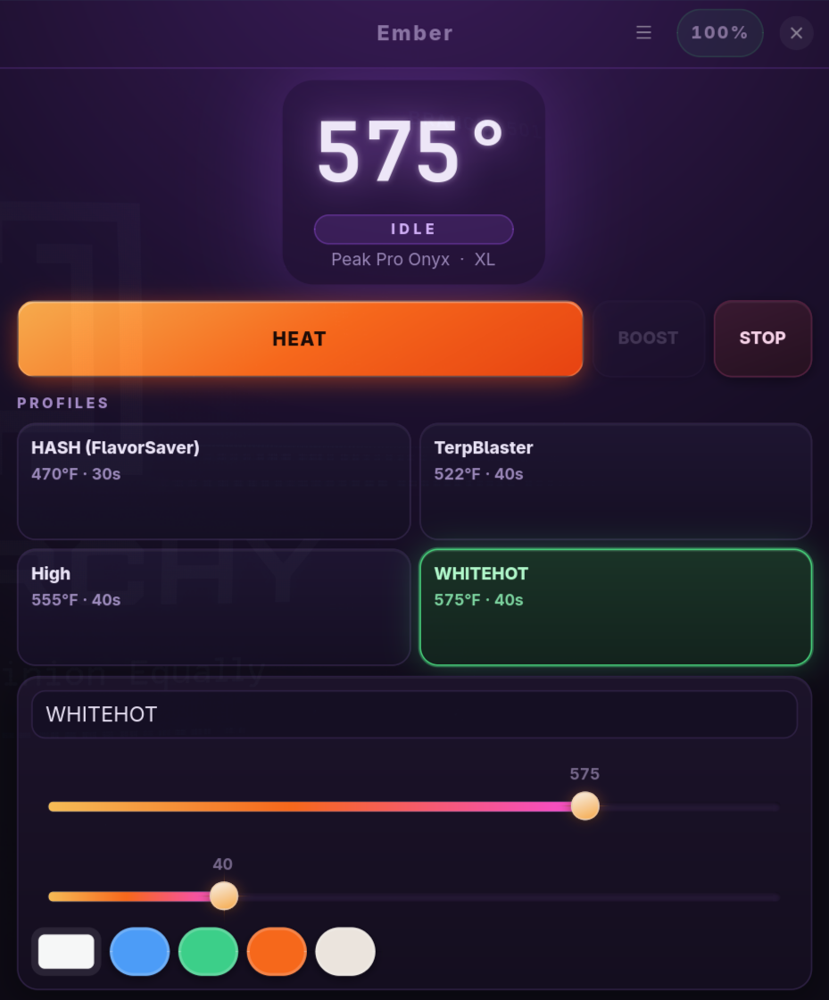

# Ember

Peak Pro companion for Linux. Not affiliated with Puffco. Firmware updates can
break the unofficial Lorax BLE protocol.

Ember talks to a **Peak Pro only**. Proxy and Pivot are rejected on purpose.



## What you get

- GTK4 app: live chamber temp, heat / boost / stop, four profiles, lantern,
  brightness, animations, stealth, sleep, power off
- CLI with the same controls
- `ember waybar` JSON for a status bar
- Usage telemetry: today / this week / this month / this year dab counts,
  tracked locally alongside the device's lifetime total and dabs-per-day
  average (see `ember stats` or the app's Usage menu)
- User systemd daemon so the GUI, CLI, and bar share one BLE connection

Protocol work is forked from [Fr0st3h/PuffcoBLE](https://github.com/Fr0st3h/PuffcoBLE)
and the [OldGrowthCrypto Linux/BlueZ fork](https://github.com/OldGrowthCrypto/Puffco).

## Install

```bash
git clone https://github.com/Auxxed/ember.git
cd ember
./install.sh
ember
```

Needs Python 3.10+, GTK4, libadwaita, BlueZ. BLE libraries are installed into
`.venv` (system GTK is reused).

Wake the Peak Pro, keep it next to the PC, and disconnect the phone app. The
radio only accepts one client.

## Bluetooth adapter

Ember picks the first powered adapter BlueZ reports, which is what you want on
almost every machine. If you have more than one radio and need to pin a
specific one, set it in `~/.config/ember/config.json`:

```json
{ "adapter": "hci1" }
```

`bluetoothctl list` shows what you have.

## CLI

```bash
ember scan
ember connect                  # or: ember connect --mac AA:BB:...
ember status
ember heat start|stop|boost
ember profile 0 --temp-f 510 --time 75 --color '#ff6a1a'
ember lantern on
ember brightness 160
ember stealth on
ember waybar
ember stats                    # dab telemetry: today/week/month/year
ember sleep
ember off
```

## Waybar

```jsonc
"custom/ember": {
  "exec": "ember waybar",
  "return-type": "json",
  "interval": 2,
  "on-click": "ember",
  "on-click-right": "ember heat start"
}
```

## Hyprland

Optional floating window rules are in `packaging/hyprland.conf`.

## Keys in the app

| Key | Action |
|-----|--------|
| Space | Heat / stop |
| B | Boost |
| S | Stop |
| 1–4 | Profiles |

## Uninstall

```bash
./uninstall.sh
```
