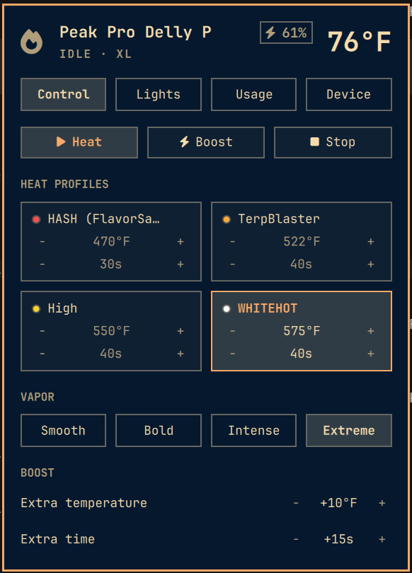

# OmaPuffco

[](https://github.com/Auxxed/omapuffco/actions/workflows/tests.yml)

Puffco Peak Pro controls for the [Omarchy](https://omarchy.org/) bar: chamber
temperature and battery at a glance, heat and profile controls, LED colors,
and usage stats read straight from the device.

OmaPuffco is unofficial and not affiliated with Puffco. It speaks the
reverse-engineered Lorax Bluetooth protocol, so a Puffco firmware update can
break it. It works with the **Peak Pro only**; Proxy and Pivot are rejected.



## Install

```bash
omarchy plugin add https://github.com/Auxxed/omapuffco --enable && ~/.config/omarchy/plugins/auxxed.omapuffco/install.sh
```

`omarchy plugin add` installs the bar widget. `install.sh` sets up what the
widget needs, all inside your home directory with no root access:

- a Python environment in `~/.local/share/omapuffco/venv` with the Bluetooth
  libraries from PyPI: [`bleak`](https://pypi.org/project/bleak/),
  [`cbor2`](https://pypi.org/project/cbor2/) and
  [`dbus-fast`](https://pypi.org/project/dbus-fast/)
- the `omapuffco` command in `~/.local/bin`
- the `omapuffco-daemon` systemd user service, which holds the one Bluetooth
  connection the widget and the command share

If you add the plugin without running `install.sh`, the widget shows
**Finish setup**, which runs it in a terminal.

Requirements: Python 3.10 or newer, BlueZ, and systemd — all present on a
standard Omarchy install.

Then wake the Peak, keep it near the computer, and disconnect the Puffco phone
app (the Peak accepts one connection at a time). Click the OmaPuffco widget and
choose **Connect**.

## Update

```bash
omarchy plugin update auxxed.omapuffco && ~/.config/omarchy/plugins/auxxed.omapuffco/install.sh
```

Used this back when it was called Ember? Run the install line above.
`install.sh` moves your settings and dab history across and swaps the old
widget out, keeping its place in the bar.

## Remove

```bash
~/.config/omarchy/plugins/auxxed.omapuffco/uninstall.sh
```

This stops the daemon, removes the `omapuffco` command and the Python environment,
and removes the plugin. Your dab history (`~/.local/share/omapuffco/dabs.json`) and
settings (`~/.config/omapuffco`) are kept; delete those folders too for a clean
removal.

## Using it

- **Bar** — chamber temperature and battery, with ⚡ while plugged in.
  Left-click opens the panel, right-click starts a heat cycle, middle-click
  refreshes.
- **Control** — Heat, Boost and Stop, with a countdown ring while the Peak
  heats up and during the session; battery saver (puts the Peak to sleep 30
  seconds after a session ends, turning the lantern off first); a chamber-clean
  reminder (every 10–100 dabs); the four heat profiles (click one to
  select it, click a value to type it, or nudge it with − and +); vapor level;
  and boost temperature and time.
- **Lights** — LED on/off, brightness, stealth mode, the selected
  profile's LED color.
- **Usage** — today, this week, this month and lifetime counts, a daily chart,
  streaks, your peak hour, and average session length and temperature.
- **Device** — rename the Peak; model, chamber, battery, firmware, serial and
  uptime; the fault log of heater, battery and pairing problems; disconnect
  so your phone or another computer can connect; sleep or power off. **Tips** has the factory heat presets (490 / 510 / 530 / 545°F)
  and a short care list.

### Where the usage numbers come from

The Peak keeps its own log of heat cycles. OmaPuffco reads it when it connects and
after each session, and counts every cycle that reached temperature;
`omapuffco sync` does the same on demand. Until the phone app sets the Peak's clock
after a restart, the log's timestamps count from boot. OmaPuffco places those using
the Peak's current clock, and skips cycles from before a later restart rather
than guessing their date. For any period the device log no longer covers, the
cycles OmaPuffco saw while connected fill in.

## Command line

The widget runs these under the hood; they also work for scripting or outside
Omarchy.

```bash
omapuffco scan
omapuffco connect                  # or: omapuffco connect --mac AA:BB:...
omapuffco disconnect               # free the Peak for your phone or another PC
omapuffco status
omapuffco heat start|stop|boost
omapuffco profile 0 --temp-f 510 --time 75 --color '#ff6a1a'
omapuffco lantern on
omapuffco brightness 160
omapuffco color '#ff6a1a' --index 0  # a profile's LED color
omapuffco stealth on
omapuffco saver on                 # sleep 30 s after each session
omapuffco clean --every 30         # remind after N dabs (10–100)
omapuffco clean done               # reset the cleaning countdown
omapuffco stats                    # today / week / month / year / lifetime
omapuffco sync                     # pull usage history from the Peak's log
omapuffco faults                   # faults the Peak recorded
omapuffco waybar
omapuffco sleep
omapuffco off
```

### Waybar

```jsonc
"custom/omapuffco": {
  "exec": "omapuffco waybar",
  "return-type": "json",
  "interval": 2,
  "on-click": "omapuffco status",
  "on-click-right": "omapuffco heat start"
}
```

## Bluetooth adapter

OmaPuffco uses the first powered adapter BlueZ reports. To pin a specific one when
you have several, set it in `~/.config/omapuffco/config.json` (`bluetoothctl list`
shows what you have):

```json
{ "adapter": "hci1" }
```

## Development

```bash
git clone https://github.com/Auxxed/omapuffco.git
cd omapuffco
./install.sh                   # links the checkout in as a development plugin
~/.local/share/omapuffco/venv/bin/pip install pytest
~/.local/share/omapuffco/venv/bin/python -m pytest
```

Keep virtual environments outside the checkout: `omarchy plugin` refuses
symlinks inside a plugin folder, and a venv is full of them.

The tests cover the CBOR and color codec, audit-log decoding, dab-history date
maths, config and profile limits, the daemon liveness probe, and the plugin
manifest. The Bluetooth layer needs real hardware, so it's exercised by hand.

Protocol work builds on [Fr0st3h/PuffcoBLE](https://github.com/Fr0st3h/PuffcoBLE)
and the [OldGrowthCrypto Linux/BlueZ fork](https://github.com/OldGrowthCrypto/Puffco);
audit-log decoding follows [puff.social](https://github.com/puff-social/web).

## License

[MIT](LICENSE)
